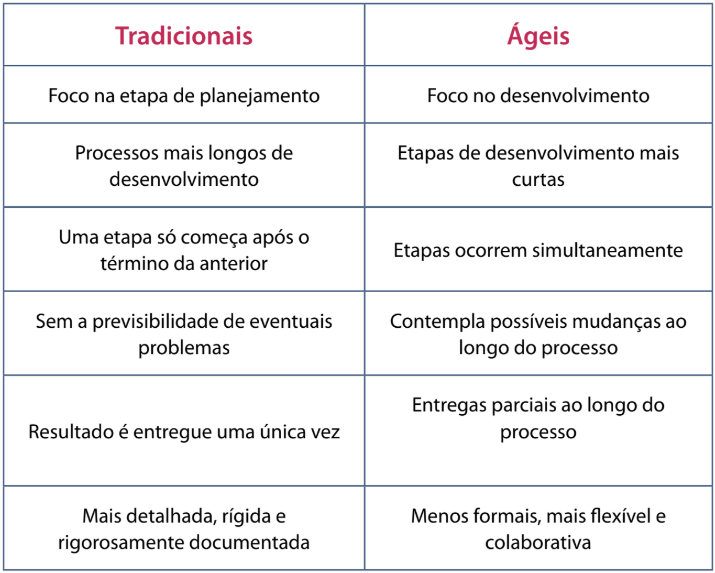
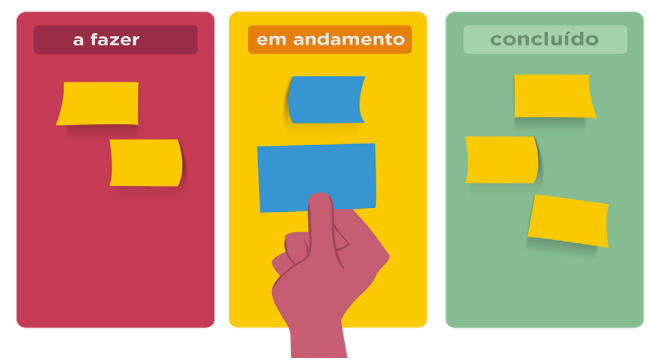
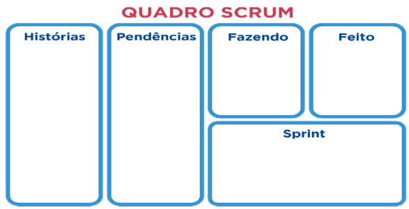
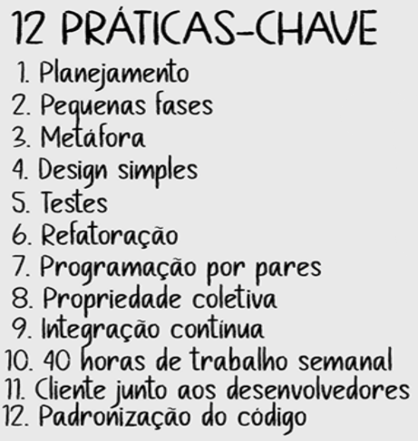
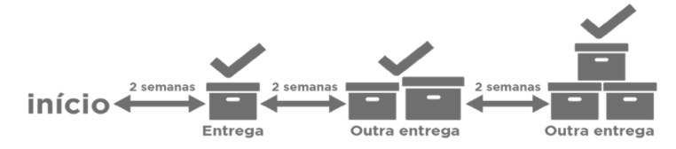
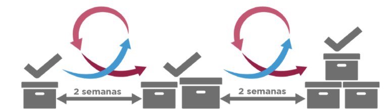

# Metodologias Ágeis

## Metodologias Tradicionais
As metodologias mais tradicionais ou clássicas possuem processos mais longos de desenvolvimento, divisão de tarefa e sequenciamento de fases bem definidas: uma depois da outra. Essas fases são planejadas no início do projeto e não há a previsão de eventuais problemas durante o percurso de construção de suas soluções.

Esse tipo de metodologia apresenta maior foco no planejamento do que na execução. É também conhecida como modelo sequencial linear ou waterfall (cascata), pois uma etapa deve ser totalmente finalizada antes de iniciar a seguinte.

### Levantamento de Requisitos
São os critérios ou necessidades que devem ser atendidas pelo produto ou serviço desenvolvido no projeto.

### Planejamento Técnico
Refere-se a todo o planejamento para executar, controlar e encerrar um projeto. Nesse momento determinam-se os objetivos, as etapas, as tarefas, as responsabilidades, o cronograma, os custos, etc.

### Desenvolvimento
Execução das ações ou tarefas determinadas na fase de planejamento técnico. Em caso de criação de sistema, seria o desenvolvimento dos códigos que atingirão as características levantadas nos requisitos.

### Testes
Ao final da implementação, testa-se o produto ou serviço para certificar ou validar que as implementações atendem aos requisitos determinados.

### Entrega em Produção
Após os testes e a correção de erros, o produto ou serviço é entregue ao cliente.

### Pontos negativos

- Metodologia mais detalhada e rígida.
- Leva mais tempo para execução e implementação do projeto.
- Dificuldades em cumprir o cronograma e os prazos de entrega.
- Há apenas uma entrega ao fim do projeto, isso determina que o resultado final pode não atender plenamente as expectativas do cliente.
- Metodologia vista como burocrática e inflexível.

## Metodologias Ágeis
As metodologias ágeis são um conjunto de comportamentos, processos e ferramentas, utilizados para criar e disponibilizar produtos ou serviços com entregas incrementais (em um ritmo maior), ou seja, desenvolver uma versão inicial, apresentá-la ao cliente e evoluir o produto ou serviço ao longo do tempo, de acordo com o feedback do usuário, com equipes ou times que realizam a autogestão.
Algumas características:
- Etapas de desenvolvimento mais curtas.
- As ações dependem do feedback dos clientes e de possíveis mudanças que podem ocorrer no dia a dia.
- Desenvolvimento dos projetos mais flexível e colaborativo.
- Comunicação mais rápida.
- Identificação e correção de erros mais rápida.

## O MANIFESTO ÁGIL
Documento elaborado e assinado em fevereiro de 2001 por 17 desenvolvedores de software que ja praticavam métodos ágeis. Esse documento é composto por 4 valores e 12 princípios.

O Manifesto ágil fundamenta-se nos seguintes valores: 
1. Indivíduos e interações mais que processos e ferramentas.
2. Software em funcionamento mais que documentação abrangente.
3. Colaboração com o cliente mais do que negociação de contratos.
4. Responder as mudanças mais que seguir um plano.

Detalhamento de cada um dos valores: 
#### 1 - Indivíduos e interações mais que processos e ferramentas.
- Ferramentas e os processos devem ser simples e úteis, bem como as relações entre as pessoas não podem ser afetadas por procedimentos rígidos.
- Cada pessoa deve ser permitida a contribuir com o seu valor único para o projeto.
- Uma conversa simples pode resolver diversos problemas se comparada a uma comunicação gerenciada e controlada.
- Valorizar pessoas em vez de processos.

#### 2 - Software em funcionamento mais que documentação abrangente.
- Documentações devem agregar valor.
- Um software em funcionamento se enquadra na definição de "pronto", ou seja, se ao menos desenvolvido, testado, integrado e documentado.
- "Apenas suficiente": é uma descrição positiva, pois significa que o projeto possui apenas o que precisa para atingir a meta, portanto, ser apenas suficiente é o mesmo que ser prática e eficiente.
- As equipes de projeto dedicam mais tempo ao desenvolvimento e menos à documentação.

#### 3 - Colaboração com o cliente mais do que negociação de contratos.
- Colaboração mútua e a presença constante do cliente nas etapas de produção. O cliente não é visto como inimigo.
- Cliente envolvido em três pontos-chave:
  - Início do projeto: negociação de detalhes do contrato.
  - Alterações: quando o escopo é alterado durante o projeto.
  - Fim do projeto: quando a equipe do projeto oferece um produto completo ao cliente. Se o projeto não atende às expectativas, o gerente de projetos e o cliente negociam alterações adicionais ao contrato.

#### 4 - Responder as mudanças mais que seguir um plano.
Planos estabelecidos são importantes, mas devem ser adaptados constantemente.

#### 12 Princípios Ágeis

1. Satisfação do Cliente: Prioridade máxima é satisfazer o cliente por meio da entrega contínua e adiantada de software de valor agregado.
2. Mudanças Bem-vindas: Aceitar mudanças de requisitos, mesmo tardiamente, para vantagem competitiva do cliente.
3. Entregas Frequentes: Entregar software funcionando frequentemente (semanas ou meses), priorizando versões menores e com valor.
4. Colaboração: Pessoas de negócios e desenvolvedores devem trabalhar juntas diariamente.
5. Indivíduos Motivados: Construir projetos em torno de pessoas motivadas, dando-lhes o ambiente e suporte necessários e confiando nelas.
6. Comunicação Face a Face: A forma mais eficiente de comunicar é a conversa presencial.
7. Software Funcionando como Medida: Software funcional é a principal medida de progresso.
8. Ritmo Sustentável: Manter um ritmo de trabalho constante e sustentável indefinidamente.
9. Excelência Técnica e Design: Atenção contínua à excelência técnica e bom design aumenta a agilidade.
10. Simplicidade: Maximizar a quantidade de trabalho não realizado (o essencial) é fundamental.
11. Auto-organização: As melhores arquiteturas e designs emergem de equipes auto-organizadas.
12. Reflexão e Adaptação: A equipe reflete regularmente sobre como se tornar mais eficaz e ajusta seu comportamento.

## CARACTERÍSTICAS GERAIS
### CICLO DE VIDA ITERATIVO E INCREMENTAL
O desenvolvimento é dividido em ciclos e os requisitos em conjuntos. Cada ciclo deve atender a um conjunto de requisitos, recebendo constante feedback até a sua entrega final. Iterativo significa que o projeto progredirá sendo aprimorado ao longo do processo de desenvolvimento.

### PLANEJAMENTO MAIS ADEQUADO
Planejamento em ciclos traz maior visibilidade sobre o desenvolvimento e completude dos requisitos.

### ADAPTABILIDADE
Adaptação a novos problemas e a percepção deles acontecem mais rapidamente.

### MITIGAÇÃO DE RISCOS
Com feedbacks rápidos, é possível aumentar a previsibilidade de possíveis problemas e contorná-los de maneira mais ágil.

### CADA ENTREGA POSSUI VALOR NO PRODUTO
- Entrega contínua: o valor da entrega do produto ocorre em cada ciclo de desenvolvimento e não somente no final do projeto.

### VANTAGENS PARA O CLIENTE
Aplicando as metodologias ágeis, não é necessário planejar de forma sequencial toda a elaboração do projeto, pois as entregas ocorrem periodicamente com feedbacks constantes.

## METODOLOGIAS TRADICIONAIS X ÁGEIS

## MÉTODOS ÁGEIS: _SCRUM_, LEAN, KANBAN E XP
Há diversos tipos de metodologias ágeis, alguns exemplos:
- Scrum
- XP
- Crystal
- Agile Modeling
- ASD Adaptive Software Development
- DSDM Dynamic Solutions Delivery Method
- FDD Feature Driven Development
- Lean Development
- Pragmatic Programming
- OpenUP
- Kanban

Todas essas metologias são baseadas na filosofia Agile, porém, cada uma tem características próprias, adequadas para projetos diferentes.

### KANBAN
Em um quadro, são dispostas todas as tarefas escritas em cartões e separadas em colunas.

### _SCRUM_
O projeto é dividido em diversas fases, chamadas _sprints_. Em geral, tem as seguintes características principais:
- Ênfase no gerenciamento de projetos.
- Times (equipes) autogerenciáveis.
- Medição diária de progresso.
- Evita seguir passos pré-definidos.
- Demonstração do sistema ao final de cada iteração

### XP 
A metodologia XP (Extreme Programming, ou programação extrema) é geralmente aplicada para o desenvolvimento de software, apresentando as seguintes características:
- Ênfase em práticas de desenvolvimento.
- Ênfase na colaboração.
- Criação de software o mais rapidamente possível.
- Valores: comunicação, feedback, simplicidade e coragem.
- 12 práticas-chave.

### LEAN DEVELOPMENT
A metodologia ágil Lean Development, ou desenvolvimento enxuto, tem por objetivo mapear desperdícios, seja de tempo e recursos, enxugando ou retirando etapas desnecessárias ao desenvolvimento do projeto. Características:
- Ênfase na redução do desperdício.
- Entregas rápidas de resultados.

## SCRUM
Scrum é uma metodologia ágil que propõe práticas de planejamento e gerenciamento para desenvolvimento de projetos de produtos e serviços.
- 1993: Criação da metodologia pelos engenheiros Jeff Sutherland e Ken Schwaber, na Easel Corporation.

### FUNCIONAMENTO GERAL DO SCRUM
O Scrum auxilia na definição de objetivos sequenciais que devem ser concluídos dentro de um determinado período. O produto inteiro não será desenvolvido, mas sim uma parte dele será conclúída.

Dentro desse intervalo entre entregas, o Scrum segue as seguintes etapas:
1. **Planejamento:** Seleção dos objetivos a serem atingidos a cada ciclo, priorizando as entregas.
2. **Desenvolvimento e validação:** Validação diária durante o ciclo, a fim de identificar quais foram suas iterações (progressões) e as possíveis dificuldades.

Durante a etapa de **desenvolvimento e validação**, há ainda outro miniciclo contínuo de inspeção e adaptação.
- **Inspeção:** Identifica a direção do desenvolvimento para evitar desvios.
- **Adaptação:** Identifica mudanças nos objetivos daquele ciclo e efetiva adaptações.

Seguindo essas etapas, podemos ter um feedback quase imediato sobre o trabalho realizado. Assim, conseguimos analisar se o que foi desenvolvido está de acordo com a proposta de valor apresentadas para aquele ciclo. Além disso, planejamos o próximo passo e também antecipamos possíveis contratempos no andamento do projeto.

### SCRUM FRAMEWORK
O _Scrum framework_ (ou a estrutura do Scrum) é formado de várias etapas, com nome e objetivos/funções bem delimitados.

---
📌 Este material é destinado a fins educacionais e introdutórios.