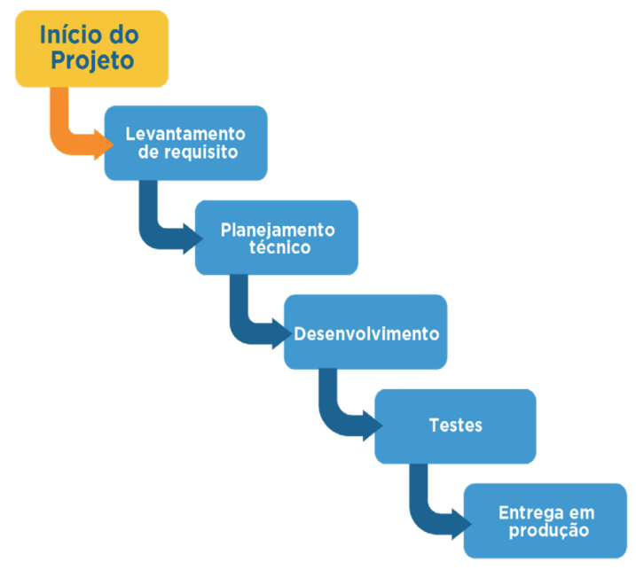

# Metodologias Ágeis

## Metodologias Tradicionais
As metodologias mais tradicionais ou clássicas possuem processos mais longos de desenvolvimento, divisão de tarefa e sequenciamento de fases bem definidas: uma depois da outra. Essas fases são planejadas no início do projeto e não há a previsão de eventuais problemas durante o percurso de construção de suas soluções.

Esse tipo de metodologia apresenta maior foco no planejamento do que na execução. É também conhecida como modelo sequencial linear ou waterfall (cascata), pois uma etapa deve ser totalmente finalizada antes de iniciar a seguinte.

## Levantamento de Requisitos
São os critérios ou necessidades que devem ser atendidas pelo produto ou serviço desenvolvido no projeto.

## Planejamento Técnico
Refere-se a todo o planejamento para executar, controlar e encerrar um projeto. Nesse momento determinam-se os objetivos, as etapas, as tarefas, as responsabilidades, o cronograma, os custos, etc.

## Desenvolvimento
Execução das ações ou tarefas determinadas na fase de planejamento técnico. Em caso de criação de sistema, seria o desenvolvimento dos códigos que atingirão as características levantadas nos requisitos.

## Testes
Ao final da implementação, testa-se o produto ou serviço para certificar ou validar que as implementações atendem aos requisitos determinados.

## Entrega em Produção
Após os testes e a correção de erros, o produto ou serviço é entregue ao cliente.

---
📌 Este material é destinado a fins educacionais e introdutórios.